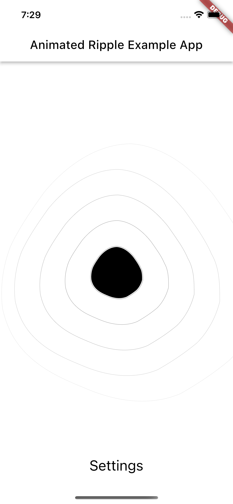

<!--
This README describes the package. If you publish this package to pub.dev,
this README's contents appear on the landing page for your package.

For information about how to write a good package README, see the guide for
[writing package pages](https://dart.dev/guides/libraries/writing-package-pages).

For general information about developing packages, see the Dart guide for
[creating packages](https://dart.dev/guides/libraries/create-library-packages)
and the Flutter guide for
[developing packages and plugins](https://flutter.dev/developing-packages).
-->

Flutter button widget, that simulates ripple effect when button is pressed.

## Features



## Usage

```dart
class Example extends StatelessWidget {
  const Example({Key? key}) : super(key: key);

  @override
  Widget build(BuildContext context) => AnimatedRipple(
    size: const Size.fromRadius(300),
    numberOfRipples: 7,
    duration: const Duration(seconds: 1),
    color: ThemeWidget.of(context).theme.mainColor,
    secondaryColor: ThemeWidget.of(context).theme.secondaryColor,
    rippleEffect: RippleEffect.speedUpOnTap,
  );
}
```
